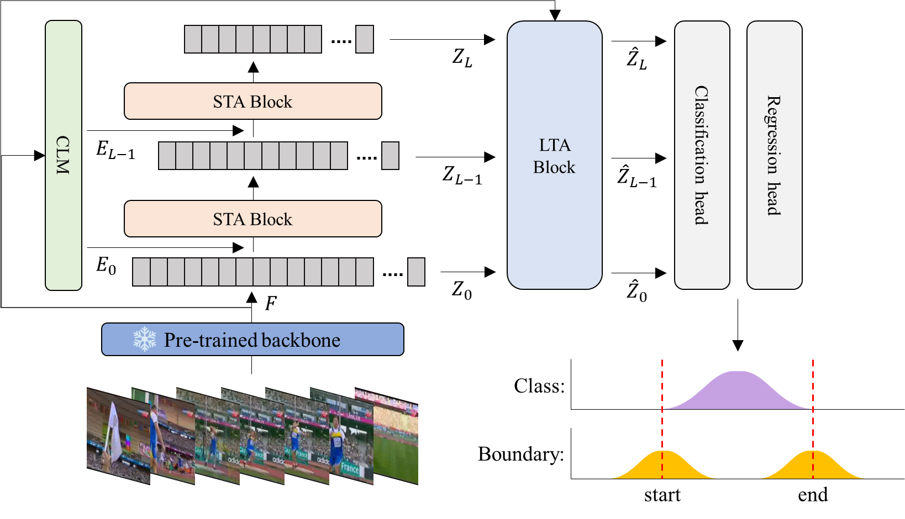

# Interpretable Information Visualization for Enhanced Temporal Action Detection In Videos

## Introduction
Temporal action detection (TAD) is one of the most active research areas in computer vision. TAD is the task of detecting actions in untrimmed videos and predicting the start and end times of the actions. TAD is a challenging task and requires a variety of temporal cues. In this paper, we present a one-stage transformer-based temporal action detection model using enhanced long- and short-term attention. Recognizing multiple actions in a video sequence requires an understanding of various temporal continuities. These temporal continuities encompass both long- and short-term temporal dependencies. To learn these long- and short-term temporal dependencies, our model leverages long- and short-term temporal attention based on transformers. In short-term temporal attention, we consider long-term memory to learn short-term temporal features and use compact long-term memory to efficiently learn long-term memory. Long-term temporal attention uses deformable attention to dynamically select the required features from long-term memory and efficiently learn the long-term features. Furthermore, our model offers interpretability for TAD by providing visualizations of class-specific probability changes for temporal action variations. This allows for a deeper understanding of the model's decision-making process and facilitates further analysis of TAD. Based on the results of experiments conducted on the THUMOS14 and ActivityNet-1.3 datasets, our proposed model achieves an improved performance compared to previous state-of-the-art models.

## Overall Architecture

  

## Training and Evaluation

We refer to [ActionFormer](https://github.com/happyharrycn/actionformer_release) repository to download and prepare data.

## Code update
Thank you for visiting this project. Please note that the code is currently being organized and refined. We appreciate your patience and understanding as we work to provide a clean and well-documented version soon.

If you have any questions or need further information, please feel free to reach out.
